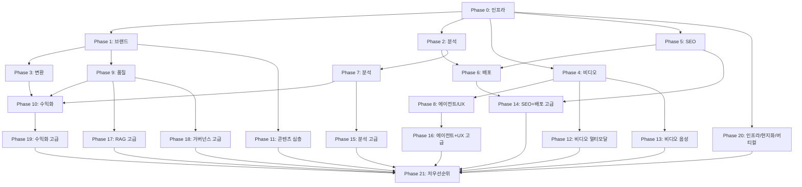

# TASKS-v2: 315개 기능 전체 구현 플랜

> 소스: `data/feature-ideas-organized.md` (20 Cycle, 315개 기능)
> 생성일: 2026-03-09
> 기존 서비스: 286개 활용, 신규 서비스 ~120개 생성 예정

## 메타데이터

- **총 기능**: 315개 (★★☆ 117 / ★☆☆ 185 / ☆☆☆ 13)
- **총 Phase**: 22개 (Phase 0~21)
- **총 태스크**: 109개
- **기술 스택**: Flask + Next.js 16 + LiteLLM + ChromaDB + Supabase
- **테스트**: `python -m pytest tests/ -v`
- **빌드**: `cd frontend && npx tsc --noEmit`

## Phase 순서

| Tier | Phase | 카테고리 | 기능 수 | 태스크 수 |
|------|-------|---------|--------|----------|
| **A ★★☆** | 0 | 인프라 기반 | 4 | 3 |
| | 1 | 브랜드 & 컨텍스트 | 10 | 5 |
| | 2 | 콘텐츠 분석 & 리서치 | 10 | 4 |
| | 3 | 콘텐츠 변환 & 자산 생성 | 9 | 4 |
| | 4 | 비디오/오디오 처리 | 12 | 5 |
| | 5 | SEO & 검색 최적화 | 11 | 4 |
| | 6 | 배포 & 마케팅 자동화 | 12 | 4 |
| | 7 | 분석 & 인텔리전스 | 13 | 4 |
| | 8 | 에이전트 & UX | 11 | 4 |
| | 9 | RAG + 품질 + 현지화 | 16 | 5 |
| | 10 | 수익화 + 버티컬 | 9 | 3 |
| **B ★☆☆** | 11 | AI 콘텐츠 심층 | 21 | 7 |
| | 12 | 비디오 멀티모달 | 16 | 5 |
| | 13 | 비디오 음성/편집 | 15 | 5 |
| | 14 | SEO + 배포 고급 | 16 | 5 |
| | 15 | 분석 고급 | 15 | 5 |
| | 16 | 에이전트 + UX 고급 | 19 | 6 |
| | 17 | RAG & 지식 그래프 | 19 | 6 |
| | 18 | 거버넌스 고급 | 13 | 4 |
| | 19 | 수익화 고급 | 18 | 6 |
| | 20 | 인프라/현지화/버티컬 | 33 | 10 |
| **C ☆☆☆** | 21 | 저우선순위 | 13 | 5 |
| | **합계** | | **315** | **109** |

---

## ═══════════════════════════════════════
## Tier A: ★★☆ Quick Wins (117개)
## ═══════════════════════════════════════

## Phase 0: 인프라 기반 (4개)

> 모든 후속 Phase의 AI 호출 비용/성능에 영향. main 브랜치에서 직접 작업.

### [] Phase 0, T0.1: 프롬프트 캐싱 시스템 (#48, #49)

**기능**: 반복 프롬프트 prefix 캐시 → 비용/지연 50% 감소, cache_control 브레이크포인트
**서비스**: `services/prompt_cache_service.py` (신규)
**테스트**: `tests/test_prompt_cache_service.py`

**함수**:
- `compute_cache_key(prompt_parts: list[str]) -> str` — 프롬프트 prefix 해시 키 생성
- `get_or_create_cache(key, prompt, ttl=3600) -> CacheEntry` — 캐시 조회/생성
- `set_breakpoints(prompt, breakpoint_indices) -> list[CacheSegment]` — 재사용 구간 명시
- `get_cache_stats() -> dict` — 히트율, 절감 비용 통계

**수정**: `services/ai_service.py` — `create_content()`에 캐시 레이어 삽입
**라우트**: `GET /api/cache/stats`, `DELETE /api/cache/clear`
**인수 조건**: 동일 스타일 반복 요청 시 캐시 히트 확인, 비용 절감 로그 출력

### [] Phase 0, T0.2: 예산 인지형 멀티모델 게이트웨이 (#51)

**기능**: 프로바이더별 예산 한도 + 자동 fallback + spend 추적
**서비스**: `services/budget_gateway_service.py` (신규)
**테스트**: `tests/test_budget_gateway_service.py`

**함수**:
- `route_request(prompt, budget_config) -> ProviderChoice` — 비용/품질 기반 라우팅
- `track_spend(provider, tokens_in, tokens_out) -> SpendRecord` — 사용량 기록
- `get_budget_status(user_id) -> BudgetReport` — 잔여 예산 조회
- `set_budget_limits(provider, daily_limit, monthly_limit)` — 한도 설정

**수정**: `services/model_router_service.py` — 기존 라우터에 예산 체크 통합
**라우트**: `GET /api/budget/status`, `POST /api/budget/limits`
**인수 조건**: 예산 초과 시 저렴한 모델로 자동 fallback, 일/월 리포트 정확

### [] Phase 0, T0.3: 비동기 배치 추론 (#52)

**기능**: 대량 요청을 비동기 큐에 넣어 저비용 처리
**서비스**: `services/batch_inference_service.py` (신규)
**테스트**: `tests/test_batch_inference_service.py`

**함수**:
- `submit_batch(requests: list[GenerateRequest]) -> batch_id` — 배치 제출
- `get_batch_status(batch_id) -> BatchStatus` — 진행률 조회
- `get_batch_results(batch_id) -> list[GenerateResult]` — 완료 결과 수집
- `cancel_batch(batch_id) -> bool` — 배치 취소

**라우트**: `POST /api/batch/submit`, `GET /api/batch/{id}/status`, `GET /api/batch/{id}/results`
**인수 조건**: 10개 URL 배치 제출 → 순차 처리 → 전체 결과 반환

---

## Phase 1: 브랜드 & 컨텍스트 관리 (10개)

> 생성 품질의 일관성과 브랜드 정합성 강화. 기존 style_memory_service 활용.

### [] Phase 1, T1.1: 태그형 컨텍스트 인퓨전 + 코퍼스 룰북 (#6, #242) RED→GREEN

**담당**: backend-specialist

**Git Worktree 설정**:
```bash
git worktree add ../ie-phase1-brand-context -b phase/1-brand-context
```

**기능**:
- #6: 브랜드 자산(톤, 용어, CTA)을 태그로 주입 → `{{brand:tone}}` 형태
- #242: 기존 콘텐츠 분석 → 편집 가이드(톤, 금지어, 선호 표현) 자동 생성

**서비스**: `services/context_infusion_service.py` (신규)
**테스트**: `tests/test_context_infusion_service.py`

**함수**:
- `register_brand_asset(user_id, tag_name, content) -> BrandAsset` — 브랜드 태그 등록
- `inject_tags(prompt, user_id) -> str` — 프롬프트 내 `{{brand:*}}` 태그 치환
- `generate_rulebook(corpus_texts: list[str]) -> EditRulebook` — 코퍼스 분석 → 룰북

**라우트**: `POST /api/brand/assets`, `GET /api/brand/assets`, `POST /api/brand/rulebook`
**인수 조건**: 태그 주입 후 생성 결과에 브랜드 톤 반영, 룰북 JSON 구조 검증

### [] Phase 1, T1.2: 브랜드 보이스 드리프트 + 가드레일 (#121, #122) RED→GREEN

**담당**: backend-specialist

**기능**:
- #121: 문단별 보이스 이탈 점수화 (기존 brand_voice_profiler_service 확장)
- #122: 생성 중 브랜드 규칙·금지어·CTA 원칙 재주입

**서비스**: `services/brand_drift_guard_service.py` (신규)
**수정**: `services/brand_voice_profiler_service.py` (기존 확장)
**테스트**: `tests/test_brand_drift_guard_service.py`

**함수**:
- `score_drift(content, brand_profile) -> list[ParagraphDrift]` — 문단별 이탈 점수
- `apply_guardrails(prompt, rules: BrandRules) -> str` — 금지어/CTA 규칙 프롬프트 삽입
- `check_violations(content, rules) -> list[Violation]` — 위반 사항 목록

**라우트**: `POST /api/brand/drift-check`, `POST /api/brand/guardrails`
**인수 조건**: 이탈 점수 0~100, 금지어 포함 시 위반 플래그

### [] Phase 1, T1.3: 세그먼트별 버전 + 스키마 발행 패키지 (#125, #68) RED→GREEN

**담당**: backend-specialist

**기능**:
- #125: 동일 원본 → 초보자/실무자/의사결정자 버전 자동 생성
- #68: 본문/메타설명/FAQ/SNS 카피를 타입 고정 스키마로 생성

**서비스**: `services/segment_version_service.py` (신규)
**서비스**: `services/publish_package_service.py` (신규)
**테스트**: `tests/test_segment_version_service.py`, `tests/test_publish_package_service.py`

**함수**:
- `generate_versions(content, segments=['beginner','practitioner','executive']) -> dict`
- `build_package(content, schema: PackageSchema) -> PublishPackage` — 타입 안전 패키지
- `validate_package(package) -> list[ValidationError]` — 스키마 검증

**라우트**: `POST /api/generate-versions`, `POST /api/publish-package`
**인수 조건**: 3개 버전 각각 톤/길이 차이 확인, 패키지 JSON Schema 검증 통과

### [] Phase 1, T1.4: 문서 AI 리스타일 + 답변 블록 컴파일러 (#8, #145) RED→GREEN

**담당**: backend-specialist

**기능**:
- #8: 문서/웹페이지를 카드형 구조+새 레이아웃으로 재구성
- #145: 긴 원고를 질문 1개 = 답변 1블록 구조로 재편집

**서비스**: `services/restyle_import_service.py` (신규)
**수정**: `services/web_scraper_service.py` (기존 활용)
**테스트**: `tests/test_restyle_import_service.py`

**함수**:
- `restyle_document(url_or_text, layout='card') -> RestyledContent` — 카드형 재구성
- `compile_answer_blocks(content) -> list[AnswerBlock]` — Q=1블록 분해
- `export_blocks(blocks, format='html') -> str`

**라우트**: `POST /api/restyle`, `POST /api/answer-blocks`
**인수 조건**: 웹페이지 URL → 카드형 HTML 변환, 답변 블록 3개+ 생성

### [] Phase 1, T1.5: 초안 라이브 코치 + 콜백 플래너 (#227, #222) RED→GREEN

**담당**: backend-specialist

**기능**:
- #227: 작성 중 실시간 피드백 + 직전 초안 대비 개선점 즉시 설명
- #222: 각 에피소드에 떡밥·회수 포인트·미해결 질문 심기

**서비스**: `services/draft_coach_service.py` (신규)
**서비스**: `services/callback_planner_service.py` (신규)
**테스트**: `tests/test_draft_coach_service.py`, `tests/test_callback_planner_service.py`

**함수**:
- `coach_feedback(current_draft, previous_draft=None) -> CoachFeedback` — 개선점 분석
- `plan_callbacks(episode_outline) -> list[CallbackPoint]` — 떡밥/회수 포인트 설계
- `check_callback_resolution(episodes: list) -> list[UnresolvedCallback]`

**라우트**: `POST /api/coach/feedback`, `POST /api/callbacks/plan`
**인수 조건**: 초안 diff 기반 피드백 3개+, 콜백 포인트에 회수 여부 추적

---

## Phase 2: 콘텐츠 분석 & 리서치 (10개)

> 영상/콘텐츠 분석 → 실행 가능한 리서치 산출물 생성.

### [] Phase 2, T2.1: SERP 브리프 + 리서치 브리프 팩 (#85, #184) RED→GREEN

**담당**: backend-specialist

**Git Worktree 설정**:
```bash
git worktree add ../ie-phase2-research -b phase/2-research
```

**서비스**: `services/serp_brief_service.py` (신규)
**수정**: `services/brief_service.py` (기존 확장)
**테스트**: `tests/test_serp_brief_service.py`

**함수**:
- `generate_serp_brief(keyword) -> SerpBrief` — PAA/경쟁페이지/통계/권장길이 포함 브리프
- `generate_research_brief(topic) -> ResearchBrief` — angle/audience/핵심질문/evidence gap

**라우트**: `POST /api/brief/serp`, `POST /api/brief/research`
**인수 조건**: SERP 브리프에 PAA 질문 3개+, 경쟁 페이지 분석 포함

### [] Phase 2, T2.2: 세일즈 배틀카드 + 성과 포스트 재작성 (#196, #24) RED→GREEN

**담당**: backend-specialist

**서비스**: `services/battlecard_service.py` (신규)
**수정**: `services/rewrite_service.py` (기존 확장)
**테스트**: `tests/test_battlecard_service.py`

**함수**:
- `extract_battlecard(video_id, transcript) -> BattleCard` — 핵심 주장/증거 구간 추출
- `rewrite_top_post(content, performance_data) -> RewrittenPost` — 성과 기반 재작성

**라우트**: `POST /api/battlecard`, `POST /api/rewrite-top`
**인수 조건**: 배틀카드에 objection/response 쌍 3개+, 재작성 글 원본 대비 변화 확인

### [] Phase 2, T2.3: 시청 페르소나 + 관심 이동 감지 (#219, #220) RED→GREEN

**담당**: backend-specialist

**서비스**: `services/viewer_persona_service.py` (신규)
**수정**: `services/audience_persona_service.py` (기존 확장)
**테스트**: `tests/test_viewer_persona_service.py`

**함수**:
- `infer_persona(watch_history: list[VideoMeta]) -> ViewerPersona` — 학습/탐험/몰입 분류
- `detect_interest_shift(recent_videos, older_videos) -> InterestShift` — 관심사 이동 감지
- `suggest_reframe(video_id, shift: InterestShift) -> str` — 다른 각도 재생성 제안

**라우트**: `POST /api/persona/infer`, `POST /api/persona/shift`
**인수 조건**: 페르소나 3유형 중 1개 분류, 관심 이동 시 재생성 제안 출력

### [] Phase 2, T2.4: 속보 브리지 + 노트 확장기 + CTA 생성기 (#226, #76, #256) RED→GREEN

**담당**: backend-specialist

**서비스**: `services/breaking_bridge_service.py` (신규)
**서비스**: `services/note_expander_service.py` (신규)
**수정**: `services/cta_optimizer_service.py` (기존 확장)
**테스트**: `tests/test_breaking_bridge_service.py`, `tests/test_note_expander_service.py`

**함수**:
- `generate_bridge(breaking_content) -> BridgePack` — 즉시반응용 + 검색형 해설 세트
- `expand_note(short_note, performance) -> ExpansionCandidate` — 성과 기반 장문 확장 판단
- `generate_upsell_ctas(tutorial_content) -> list[CtaPoint]` — 구매 의도 지점 포착

**라우트**: `POST /api/bridge`, `POST /api/note/expand`, `POST /api/cta/upsell`
**인수 조건**: 속보 2버전(즉시/검색형) 생성, CTA 포인트 2개+ 위치 지정

---

## Phase 3: 콘텐츠 변환 & 자산 생성 (9개)

> 영상 1편 → 다양한 포맷 자산으로 변환.

### [] Phase 3, T3.1: 슬라이드 스토리보드 + 프레임-카드 (#93, #283) RED→GREEN

**담당**: backend-specialist

**Git Worktree 설정**:
```bash
git worktree add ../ie-phase3-conversion -b phase/3-conversion
```

**서비스**: `services/storyboard_service.py` (신규)
**수정**: `services/slide_service.py` (기존 확장)
**테스트**: `tests/test_storyboard_service.py`

**함수**:
- `generate_storyboard(transcript, video_id) -> Storyboard` — 발표용 아웃라인+슬라이드 구조
- `create_frame_cards(transcript, key_frames) -> list[FrameCard]` — carousel 카드 비주얼 설계

**라우트**: `POST /api/storyboard`, `POST /api/frame-cards`
**인수 조건**: 슬라이드 5장+ 구조, 프레임 카드 3장+ 생성

### [] Phase 3, T3.2: 응답 기반 후속 + CS 자산팩 (#101, #300) RED→GREEN

**담당**: backend-specialist

**서비스**: `services/response_followup_service.py` (신규)
**서비스**: `services/cs_asset_pack_service.py` (신규)
**테스트**: `tests/test_response_followup_service.py`, `tests/test_cs_asset_pack_service.py`

**함수**:
- `generate_followup(quiz_responses, video_id) -> PersonalizedContent` — 응답별 맞춤 요약
- `build_cs_pack(support_video_id) -> CsAssetPack` — 교육 패킷/셀프서브 도움말 변환

**라우트**: `POST /api/followup`, `POST /api/cs-pack`
**인수 조건**: 퀴즈 응답 3개 → 각기 다른 후속 콘텐츠, CS팩에 FAQ 5개+ 포함

### [] Phase 3, T3.3: 녹화→가이드 + 올핸즈 클립 브리핑 (#155, #290) RED→GREEN

**담당**: backend-specialist

**서비스**: `services/recording_guide_service.py` (신규)
**서비스**: `services/allhands_briefing_service.py` (신규)
**테스트**: `tests/test_recording_guide_service.py`, `tests/test_allhands_briefing_service.py`

**함수**:
- `recording_to_guide(transcript) -> StepGuide` — 동작 선별 → 단계별 가이드
- `create_briefing_pack(townhall_transcript) -> BriefingPack` — 핵심 결정문+짧은 클립 구간

**라우트**: `POST /api/guide/from-recording`, `POST /api/briefing-pack`
**인수 조건**: 가이드 단계 5개+, 브리핑 팩에 클립 구간 3개+ 포함

### [] Phase 3, T3.4: Q&A 캐스케이드 + 리뷰 매트릭서 + 서사 비트 + 증거 후기 (#291, #297, #301, #307) RED→GREEN

**담당**: backend-specialist

**서비스**: `services/qa_cascade_service.py` (신규)
**서비스**: `services/review_matrix_service.py` (신규)
**서비스**: `services/narrative_beat_service.py` (신규)
**서비스**: `services/testimonial_extractor_service.py` (신규)
**테스트**: `tests/test_qa_cascade_service.py`, `tests/test_review_matrix_service.py`, `tests/test_narrative_beat_service.py`, `tests/test_testimonial_extractor_service.py`

**함수**:
- `generate_qa_cascade(transcript) -> list[QaPair]` — 직원 예상 질문+관리자 답변
- `create_comparison_matrix(reviews: list) -> ComparisonTable` — 제품별 비교표
- `tag_narrative_beats(transcript) -> list[NarrativeBeat]` — 도입-전개-전환-클라이맥스
- `extract_testimonials(interview_transcript) -> list[TestimonialCard]` — 사회적 증거 카드

**라우트**: `POST /api/qa-cascade`, `POST /api/review-matrix`, `POST /api/narrative-beats`, `POST /api/testimonials`
**인수 조건**: 각 서비스 테스트 8개+ 통과

---

## Phase 4: 비디오/오디오 처리 (12개)

> 영상 분석·편집·하이라이트 자동화.

### [] Phase 4, T4.1: 바이럴 하이라이트 + 키워드 클립 (#38, #39) RED→GREEN

**담당**: backend-specialist

**Git Worktree 설정**:
```bash
git worktree add ../ie-phase4-video -b phase/4-video
```

**서비스**: `services/viral_highlight_service.py` (신규)
**수정**: `services/video_clip_service.py` (기존 확장)
**테스트**: `tests/test_viral_highlight_service.py`

**함수**:
- `score_highlights(transcript, segments) -> list[HighlightScore]` — 훅/감정/정보밀도 점수화
- `extract_keyword_clips(transcript, keywords, speaker=None) -> list[Clip]` — 조건형 클립

**라우트**: `POST /api/highlights/score`, `POST /api/highlights/keyword-clips`
**인수 조건**: 점수 0~100 범위, 키워드 매칭 클립 시작/종료 타임스탬프 정확

### [] Phase 4, T4.2: 화자 식별 + 하이라이트 그래프 (#43, #44) RED→GREEN

**담당**: backend-specialist

**서비스**: `services/speaker_identification_service.py` (신규)
**서비스**: `services/highlight_graph_service.py` (신규)
**테스트**: `tests/test_speaker_identification_service.py`, `tests/test_highlight_graph_service.py`

**함수**:
- `identify_speakers(transcript, candidates: list[SpeakerCandidate]) -> list[LabeledSegment]`
- `build_interest_timeline(transcript) -> InterestTimeline` — 영상 전체 관심도 그래프
- `generate_preview(timeline, top_n=3) -> list[PreviewClip]`

**라우트**: `POST /api/speakers/identify`, `POST /api/highlights/timeline`
**인수 조건**: 화자 라벨 정확도 검증, 타임라인 JSON 구조 확인

### [] Phase 4, T4.3: 자막 리듬 최적화 + 트랜스크립트 편집기 (#59, #61) RED→GREEN

**담당**: backend-specialist

**서비스**: `services/subtitle_rhythm_service.py` (신규)
**수정**: `services/transcript_workspace_service.py` (기존 확장)
**테스트**: `tests/test_subtitle_rhythm_service.py`

**함수**:
- `optimize_rhythm(srt_content) -> OptimizedSrt` — 줄바꿈/구간/타이밍 최적화
- `text_to_cuts(transcript_edits: list[Edit]) -> list[CutPoint]` — 텍스트 편집 → 컷 포인트

**라우트**: `POST /api/subtitle/optimize`, `POST /api/transcript/cuts`
**인수 조건**: SRT 입력 → 최적화된 SRT 출력, 삭제된 텍스트 → 해당 구간 컷 생성

### [] Phase 4, T4.4: 쇼노트 빌더 + 챕터드 스튜디오 (#80, #238) RED→GREEN

**담당**: backend-specialist

**서비스**: `services/shownotes_builder_service.py` (신규)
**수정**: `services/chapter_service.py` (기존 확장)
**테스트**: `tests/test_shownotes_builder_service.py`

**함수**:
- `build_shownotes(transcript, metadata) -> ShowNotes` — 챕터/인물/링크/전사 포함
- `create_chaptered_studio(video_id) -> ChapteredStudio` — 에피소드 요약+타임스탬프

**라우트**: `POST /api/shownotes`, `POST /api/chaptered-studio`
**인수 조건**: 쇼노트에 챕터 3개+, 인물 링크 포함

### [] Phase 4, T4.5: AI 편집 에이전트 + 리프레임 + 썸네일 CTR + 장면 챕터 (#112, #114, #116, #131) RED→GREEN

**담당**: backend-specialist

**서비스**: `services/video_edit_agent_service.py` (신규)
**서비스**: `services/smart_reframe_service.py` (신규)
**서비스**: `services/thumbnail_ctr_service.py` (신규)
**서비스**: `services/scene_chapter_service.py` (신규)
**테스트**: `tests/test_video_edit_agent_service.py`, `tests/test_smart_reframe_service.py`, `tests/test_thumbnail_ctr_service.py`, `tests/test_scene_chapter_service.py`

**함수**:
- `process_edit_command(video_id, command: str) -> EditResult` — 자연어 편집 명령
- `reframe_for_shorts(video_meta, aspect='9:16') -> ReframeResult` — 인물 추적 리프레임
- `generate_thumbnail_variants(video_id, n=4) -> list[ThumbnailVariant]` — 변형+CTR 예측
- `detect_scene_chapters(transcript, visual_cues=None) -> list[SceneChapter]`

**라우트**: `POST /api/video/edit`, `POST /api/video/reframe`, `POST /api/thumbnail/variants`, `POST /api/scene-chapters`
**인수 조건**: 각 서비스 테스트 8개+ 통과

---

## Phase 5: SEO & 검색 최적화 (11개)

> AEO(AI 검색 최적화) + 전통 SEO 강화.

### [] Phase 5, T5.1: 프롬프트 점유율 + AI 인용 소스 맵 (#53, #54) RED→GREEN

**담당**: backend-specialist

**Git Worktree 설정**:
```bash
git worktree add ../ie-phase5-seo -b phase/5-seo
```

**서비스**: `services/prompt_share_tracker_service.py` (신규)
**서비스**: `services/ai_citation_map_service.py` (신규)
**테스트**: `tests/test_prompt_share_tracker_service.py`, `tests/test_ai_citation_map_service.py`

**함수**:
- `track_prompt_share(prompts: list[str], brand, competitors) -> ShareReport`
- `map_citations(ai_responses: list) -> CitationMap` — 인용 도메인/URL/유형 분석

**라우트**: `POST /api/aeo/prompt-share`, `POST /api/aeo/citation-map`
**인수 조건**: 점유율 % 계산, 인용 소스 도메인별 집계

### [] Phase 5, T5.2: 구매자 질문 탐색 + llms.txt (#56, #67) RED→GREEN

**담당**: backend-specialist

**서비스**: `services/buyer_prompt_explorer_service.py` (신규)
**서비스**: `services/llms_txt_service.py` (신규)
**테스트**: `tests/test_buyer_prompt_explorer_service.py`, `tests/test_llms_txt_service.py`

**함수**:
- `explore_buyer_prompts(category) -> list[BuyerPrompt]` — 구매 의도 질문 수집
- `generate_llms_txt(pages: list[PageMeta]) -> str` — llms.txt 자동 생성
- `validate_llms_txt(content: str) -> list[ValidationIssue]` — 검증

**라우트**: `POST /api/aeo/buyer-prompts`, `POST /api/llms-txt/generate`, `POST /api/llms-txt/validate`
**인수 조건**: 질문 세트 카테고리별 5개+, llms.txt 형식 검증 통과

### [] Phase 5, T5.3: LLM 점유율 + 인용 갭 + 내부링크 (#128, #129, #137) RED→GREEN

**담당**: backend-specialist

**서비스**: `services/llm_share_board_service.py` (신규)
**서비스**: `services/citation_gap_service.py` (신규)
**수정**: `services/internal_link_service.py` (기존 확장)
**테스트**: `tests/test_llm_share_board_service.py`, `tests/test_citation_gap_service.py`

**함수**:
- `compare_llm_share(brand, competitors) -> ShareBoard` — AI 검색 언급 비교
- `find_citation_gaps(our_content, competitor_citations) -> list[GapOpportunity]`
- `suggest_internal_links(new_content, archive) -> list[LinkSuggestion]` — 클러스터 연결

**라우트**: `POST /api/aeo/llm-share`, `POST /api/aeo/citation-gaps`, `POST /api/seo/internal-links`
**인수 조건**: 점유율 경쟁사 대비 시각화 데이터, 갭 3개+ 발견

### [] Phase 5, T5.4: 가독성 점수 + 에버그린 감지 + 건강도 + 답변 마커 (#138, #161, #197, #230) RED→GREEN

**담당**: backend-specialist

**수정**: `services/readability_service.py` (기존 확장 — AI 인용 용이성 추가)
**서비스**: `services/evergreen_detector_service.py` (신규)
**서비스**: `services/content_health_service.py` (신규)
**서비스**: `services/answer_moment_service.py` (신규)
**테스트**: `tests/test_evergreen_detector_service.py`, `tests/test_content_health_service.py`, `tests/test_answer_moment_service.py`

**함수**:
- `score_ai_citability(content) -> float` — LLM 인용 용이성 점수
- `detect_expiry_signals(content) -> list[ExpirySignal]` — 날짜/통계/제품명 변동 감지
- `compute_health_score(content_meta) -> HealthReport` — 감쇠/완성도/고아위험 합산
- `mark_answer_moments(transcript) -> list[AnswerMoment]` — Q&A 구간 40~60단어 블록

**라우트**: `POST /api/seo/citability`, `POST /api/seo/evergreen-check`, `POST /api/seo/health`, `POST /api/seo/answer-moments`
**인수 조건**: 각 점수 0~100 범위, 만료 신호에 날짜/통계 포함

---

## Phase 6: 배포 & 마케팅 자동화 (12개)

> 멀티채널 배포, 실험, 타이밍 최적화.

### [] Phase 6, T6.1: 채널별 분기 + 숏폼 리퍼포징 (#22, #23) RED→GREEN

**담당**: backend-specialist

**Git Worktree 설정**:
```bash
git worktree add ../ie-phase6-distribution -b phase/6-distribution
```

**서비스**: `services/channel_fork_service.py` (신규)
**수정**: `services/repurpose_service.py` (기존 확장)
**테스트**: `tests/test_channel_fork_service.py`

**함수**:
- `fork_for_channels(content, channels: list[ChannelConfig]) -> dict[str, ChannelPost]`
- `repurpose_longform(content) -> RepurposePack` — 스레드/카드뉴스/이메일 티저 분해

**라우트**: `POST /api/distribute/fork`, `POST /api/distribute/repurpose`
**인수 조건**: 채널별 글자수/톤 차이 확인, 리퍼포즈 3포맷+ 출력

### [] Phase 6, T6.2: 캠페인 분석 + 추천 핏 스코어 (#26, #77) RED→GREEN

**담당**: backend-specialist

**서비스**: `services/campaign_tag_service.py` (신규)
**서비스**: `services/creator_fit_service.py` (신규)
**테스트**: `tests/test_campaign_tag_service.py`, `tests/test_creator_fit_service.py`

**함수**:
- `analyze_campaign(tag, posts: list) -> CampaignReport` — 태그별 성과 집계
- `score_creator_fit(creator_profile, our_profile) -> FitScore` — 교차 추천 적합도

**라우트**: `POST /api/campaign/analyze`, `POST /api/creator/fit-score`
**인수 조건**: 캠페인 집계에 참여율/도달 포함, 핏 스코어 0~100

### [] Phase 6, T6.3: 제목 실험 + 바이럴 댓글 선점 (#117, #123) RED→GREEN

**담당**: backend-specialist

**수정**: `services/thumbnail_ab_service.py` (기존 확장)
**서비스**: `services/viral_comment_service.py` (신규)
**테스트**: `tests/test_viral_comment_service.py`

**함수**:
- `run_title_experiment(video_id, variants: list[str]) -> ExperimentResult`
- `draft_viral_comment(post_url, brand_voice) -> CommentDraft` — 브랜드톤 댓글 초안

**라우트**: `POST /api/experiment/title`, `POST /api/social/viral-comment`
**인수 조건**: 실험 결과에 승자 선정 로직, 댓글 초안 브랜드 톤 검증

### [] Phase 6, T6.4: 게시 윈도우 + 시즌 예보 + 통계 실험 + 네이티브 스레드 + 속도 거버너 + 콘텐츠 일몰 (#150, #151, #193, #202, #255, #299) RED→GREEN

**담당**: backend-specialist

**서비스**: `services/post_window_service.py` (신규)
**서비스**: `services/season_forecast_service.py` (신규)
**서비스**: `services/headline_experiment_service.py` (신규)
**서비스**: `services/native_thread_service.py` (신규)
**서비스**: `services/velocity_governor_service.py` (신규)
**서비스**: `services/content_sunset_service.py` (신규)
**테스트**: 각 서비스별 테스트 파일 6개

**함수** (각 1~2개씩):
- `predict_best_window(history, followers) -> list[TimeSlot]`
- `forecast_season(topic) -> SeasonForecast` — 상승/성수기/재점화 분류
- `run_headline_ab(headlines, audience_sample) -> WinnerHeadline`
- `convert_to_thread(content, platform) -> ThreadParts` — Threads/Bluesky/Mastodon
- `calculate_velocity(channel_stats) -> VelocityRecommendation`
- `plan_sunset(content_id, replacement_url=None) -> SunsetPlan`

**라우트**: 6개 엔드포인트 (`/api/post-window`, `/api/season-forecast`, `/api/headline-experiment`, `/api/native-thread`, `/api/velocity`, `/api/sunset`)
**인수 조건**: 각 서비스 테스트 8개+ 통과

---

## Phase 7: 분석 & 인텔리전스 (13개)

> 소셜/경쟁/성과 분석 자동화.

### [] Phase 7, T7.1: 내러티브 탐색 + 인텐트 마이너 (#57, #58) RED→GREEN

**담당**: backend-specialist

**Git Worktree 설정**:
```bash
git worktree add ../ie-phase7-analytics -b phase/7-analytics
```

**서비스**: `services/narrative_explorer_service.py` (신규)
**서비스**: `services/intent_cluster_service.py` (신규)
**테스트**: `tests/test_narrative_explorer_service.py`, `tests/test_intent_cluster_service.py`

**함수**:
- `explore_narratives(topic, sources=['social','news']) -> list[Narrative]`
- `mine_intent_clusters(comments: list[str]) -> list[IntentCluster]` — 의도별 군집화

**라우트**: `POST /api/analytics/narratives`, `POST /api/analytics/intent-clusters`
**인수 조건**: 내러티브 3개+ 식별, 인텐트 클러스터 5개+ 그룹핑

### [] Phase 7, T7.2: 영향원 레이더 + 크리에이터 매처 (#88, #165) RED→GREEN

**담당**: backend-specialist

**서비스**: `services/influence_radar_service.py` (신규)
**서비스**: `services/creator_matcher_service.py` (신규)
**테스트**: `tests/test_influence_radar_service.py`, `tests/test_creator_matcher_service.py`

**함수**:
- `scan_hidden_sources(audience_data) -> list[InfluenceSource]`
- `match_creators(channel_profile, candidates) -> list[MatchResult]` — 의미 유사도 매칭

**라우트**: `POST /api/analytics/influence-radar`, `POST /api/analytics/creator-match`
**인수 조건**: 영향원 소스 5개+, 매칭 점수 0~100

### [] Phase 7, T7.3: 실험 학습 루프 + 포트폴리오 히트맵 + 자동 리프레시 (#154, #168, #180) RED→GREEN

**담당**: backend-specialist

**서비스**: `services/experiment_learning_service.py` (신규)
**서비스**: `services/portfolio_heatmap_service.py` (신규)
**수정**: `services/freshness_monitor_service.py` (기존 확장)
**테스트**: `tests/test_experiment_learning_service.py`, `tests/test_portfolio_heatmap_service.py`

**함수**:
- `learn_from_experiment(result: ExperimentResult) -> LearningRule`
- `generate_heatmap(library, market_topics) -> HeatmapData` — 과포화/미개척 시각화
- `queue_for_refresh(content_list, decay_threshold) -> list[RefreshCandidate]`

**라우트**: `POST /api/analytics/experiment-learn`, `POST /api/analytics/portfolio-heatmap`, `POST /api/analytics/refresh-queue`
**인수 조건**: 학습 규칙 자연어 요약, 히트맵 JSON 구조 검증

### [] Phase 7, T7.4: 경쟁 역공학 + 감성 전환 + 토픽 알림 + 벤치마크 + 내러티브 보드 + OPS 관제 (#215, #240, #241, #264, #266, #305) RED→GREEN

**담당**: backend-specialist

**서비스**: `services/competitor_reverse_service.py` (신규)
**서비스**: `services/sentiment_timeline_service.py` (신규)
**서비스**: `services/topic_alert_service.py` (신규)
**서비스**: `services/benchmark_engine_service.py` (신규)
**서비스**: `services/board_narrative_service.py` (신규)
**서비스**: `services/content_ops_dashboard_service.py` (신규)
**테스트**: 각 서비스별 테스트 파일 6개

**함수** (각 1~2개):
- `reverse_engineer(competitor_channel) -> StrategyTemplate`
- `build_sentiment_timeline(content_id, period) -> SentimentTimeline`
- `set_topic_alert(topic, threshold) -> Alert`
- `benchmark_against(content, rubric) -> BenchmarkScore`
- `generate_board_pack(channel_data, period='monthly') -> BoardPack`
- `get_ops_dashboard() -> OpsDashboard` — 토큰비용/지연/실패율/품질

**라우트**: 6개 엔드포인트
**인수 조건**: 각 서비스 테스트 8개+ 통과

---

## Phase 8: 에이전트 & UX (11개)

> AI 파이프라인 자동화 + 편집/승인 UX.

### [] Phase 8, T8.1: 품질 심사-재작성 루프 + 인터럽트 게이트 (#13, #14) RED→GREEN

**담당**: backend-specialist

**Git Worktree 설정**:
```bash
git worktree add ../ie-phase8-agent-ux -b phase/8-agent-ux
```

**서비스**: `services/quality_rewrite_loop_service.py` (신규)
**서비스**: `services/interrupt_gate_service.py` (신규)
**테스트**: `tests/test_quality_rewrite_loop_service.py`, `tests/test_interrupt_gate_service.py`

**함수**:
- `run_quality_loop(content, criteria, max_iterations=3) -> QualityResult` — 생성→평가→재작성
- `create_gate(pipeline_id, step) -> GateState` — 파이프라인 일시정지
- `submit_gate_decision(gate_id, decision: 'approve'|'reject'|'edit', edits=None) -> GateState`

**라우트**: `POST /api/pipeline/quality-loop`, `POST /api/pipeline/gate`, `POST /api/pipeline/gate/{id}/decide`
**인수 조건**: 3회 반복 후 품질 점수 상승, 게이트 상태 전이(pending→approved/rejected)

### [] Phase 8, T8.2: 에이전트 핸드오프 + 콘텐츠 계보 Diff (#16, #136) RED→GREEN

**담당**: backend-specialist

**서비스**: `services/agent_handoff_service.py` (신규)
**서비스**: `services/content_lineage_service.py` (신규)
**테스트**: `tests/test_agent_handoff_service.py`, `tests/test_content_lineage_service.py`

**함수**:
- `handoff(current_agent, next_agent, context) -> HandoffResult` — 에이전트 간 직접 전달
- `track_lineage(original_id, derived_id, transform_type) -> LineageNode`
- `compute_semantic_diff(version_a, version_b) -> SemanticDiff` — 의미 단위 비교

**라우트**: `POST /api/agent/handoff`, `GET /api/lineage/{content_id}`, `POST /api/lineage/diff`
**인수 조건**: 핸드오프 컨텍스트 보존, diff에 추가/삭제/변경 구분

### [] Phase 8, T8.3: 인라인 승인 + Artifact 워크스페이스 + Trace Replay (#31, #34, #36) RED→GREEN

**담당**: frontend-specialist + backend-specialist

**서비스**: `services/inline_approval_service.py` (신규)
**서비스**: `services/artifact_workspace_service.py` (신규)
**서비스**: `services/trace_replay_service.py` (신규)
**테스트**: 각 서비스별 테스트 파일 3개
**프론트엔드**: `frontend/components/workspace/` (신규 디렉토리)

**함수**:
- `submit_action(action_id, decision) -> ActionResult` — 인라인 승인/거절
- `create_workspace(session_id) -> Workspace` — 산출물 독립 워크스페이스
- `record_trace(pipeline_run) -> TraceRecord` — 단계별 실행 기록
- `replay_trace(trace_id) -> list[TraceStep]` — 토큰/비용/지연 오버레이

**라우트**: `POST /api/action/decide`, `POST /api/workspace`, `GET /api/trace/{run_id}`
**인수 조건**: 승인 후 다음 단계 진행, 트레이스에 비용 합계 포함

### [] Phase 8, T8.4: 핸즈프리 캡처 + 음성 초안 + 타임코드 리뷰 + 팬 앵글 (#198, #199, #213, #263) RED→GREEN

**담당**: backend-specialist

**서비스**: `services/handsfree_capture_service.py` (신규)
**서비스**: `services/voice_draft_service.py` (신규)
**서비스**: `services/timecode_review_service.py` (신규)
**서비스**: `services/fan_angle_service.py` (신규)
**테스트**: 각 서비스별 테스트 파일 4개

**함수**:
- `capture_speech(audio_stream) -> CapturedText` — 말 → 정돈된 텍스트
- `refine_voice_draft(raw_speech) -> RefinedDraft` — 말버릇 제거, 문맥 정제
- `add_timecode_annotation(transcript, timecode, note) -> Annotation`
- `suggest_fan_angles(content, comments) -> list[FanAngle]` — 팬 해석 각도 제안

**라우트**: `POST /api/capture`, `POST /api/voice-draft`, `POST /api/timecode-review`, `POST /api/fan-angles`
**인수 조건**: 각 서비스 테스트 8개+ 통과

---

## Phase 9: RAG + 품질 + 현지화 (16개)

> 지식 수집 강화, 콘텐츠 품질 보증, 다국어 지원.

### [] Phase 9, T9.1: 구조 인지형 파싱 + 웹사이트 수집 + 멀티포맷 업로더 (#18, #72, #73) RED→GREEN

**담당**: backend-specialist

**Git Worktree 설정**:
```bash
git worktree add ../ie-phase9-rag-quality -b phase/9-rag-quality
```

**수정**: `services/rag/chunker.py` (기존 확장 — layout-aware 청킹)
**수정**: `services/web_scraper_service.py` (기존 확장 — 사이트 전체 수집)
**수정**: `services/document_ingest_service.py` (기존 확장 — PPTX/XLSX/이미지)
**테스트**: `tests/test_layout_chunker.py`, `tests/test_site_crawler.py`

**함수**:
- `chunk_with_layout(document, doc_type) -> list[LayoutChunk]` — 표/슬라이드/헤딩 인식
- `crawl_site(base_url, max_pages=100) -> list[PageContent]` — 사이트 전체 수집
- `ingest_multiformat(file, file_type) -> IngestResult` — PPTX/XLSX/이미지 지원

**라우트**: `POST /api/rag/chunk-layout`, `POST /api/rag/crawl-site`
**인수 조건**: 표 포함 문서 → 표 구조 보존 청킹, 사이트 수집 100페이지 제한

### [] Phase 9, T9.2: 루브릭 스코어카드 + 프롬프트 보안 테스트 (#69, #70) RED→GREEN

**담당**: backend-specialist

**서비스**: `services/rubric_scorecard_service.py` (신규)
**서비스**: `services/prompt_security_service.py` (신규)
**테스트**: `tests/test_rubric_scorecard_service.py`, `tests/test_prompt_security_service.py`

**함수**:
- `score_content(content, rubric: Rubric) -> Scorecard` — 사실성/브랜드/인용/SEO 채점
- `run_security_tests(prompt_template, test_suite='default') -> SecurityReport`

**라우트**: `POST /api/quality/scorecard`, `POST /api/quality/security-test`
**인수 조건**: 스코어카드 4개 항목 각 0~100, 보안 테스트 통과/실패 목록

### [] Phase 9, T9.3: 인용 근거팩 + AI 검증 큐 + 규정 문구 삽입 (#119, #120, #126) RED→GREEN

**담당**: backend-specialist

**서비스**: `services/citation_evidence_service.py` (신규)
**서비스**: `services/ai_verification_queue_service.py` (신규)
**서비스**: `services/regulatory_insert_service.py` (신규)
**테스트**: 각 서비스별 테스트 파일 3개

**함수**:
- `attach_evidence(content) -> EvidencePack` — 주장마다 검증 링크+bibliography
- `queue_for_verification(content_id) -> VerificationTicket` — 사람 최종 승인 큐
- `insert_regulatory(content, content_type='finance') -> str` — 필수 문구/면책조항 삽입

**라우트**: `POST /api/quality/evidence`, `POST /api/quality/verify-queue`, `POST /api/quality/regulatory`
**인수 조건**: 인용 3개+ 첨부, 규정 삽입 후 면책조항 포함 확인

### [] Phase 9, T9.4: 대량 수정 큐 + 적대적 테스트 + 출처 서명 + 면책 맵 (#144, #210, #276, #293) RED→GREEN

**담당**: backend-specialist

**서비스**: `services/bulk_review_queue_service.py` (신규)
**서비스**: `services/adversarial_test_service.py` (신규)
**서비스**: `services/provenance_stamp_service.py` (신규)
**서비스**: `services/disclaimer_map_service.py` (신규)
**테스트**: 각 서비스별 테스트 파일 4개

**함수**:
- `queue_bulk_edits(contents, edit_type='seo') -> list[EditProposal]` — diff 화면용
- `stress_test(content, personas=['skeptic','regulator']) -> list[StressResult]`
- `stamp_provenance(content) -> ProvenanceRecord` — invisible watermark + label
- `map_disclaimers(content) -> list[DisclaimerTrigger]` — 가격/성능 약속 → 고지문

**라우트**: `POST /api/quality/bulk-review`, `POST /api/quality/stress-test`, `POST /api/quality/provenance`, `POST /api/quality/disclaimers`
**인수 조건**: 각 서비스 테스트 8개+ 통과

### [] Phase 9, T9.5: ALT 텍스트 + 번역 메모리 + 쉬운말 변환 + 인지 접근성 (#89, #98, #189, #190) RED→GREEN

**담당**: backend-specialist

**서비스**: `services/alt_text_workbench_service.py` (신규)
**서비스**: `services/translation_memory_service.py` (신규)
**서비스**: `services/plain_language_service.py` (신규)
**서비스**: `services/cognitive_accessibility_service.py` (신규)
**테스트**: 각 서비스별 테스트 파일 4개

**함수**:
- `generate_alt_texts(images: list, page_context) -> list[AltText]` — 문맥 인지형 대체텍스트
- `lookup_memory(sentence, target_lang) -> TranslationMatch | None` — 이전 승인 번역 재사용
- `simplify_text(content, level='easy') -> str` — 독해 수준별 쉬운말 변환
- `apply_cognitive_preset(content, preset='dyslexia') -> str` — 인지 접근성 프리셋

**라우트**: `POST /api/a11y/alt-text`, `POST /api/l10n/translate-memory`, `POST /api/a11y/simplify`, `POST /api/a11y/cognitive`
**인수 조건**: ALT 텍스트 다국어 지원, 번역 메모리 재사용률 확인

---

## Phase 10: 수익화 + 버티컬 (9개)

> 수익 최적화 + 산업별 특화 기능.

### [] Phase 10, T10.1: 텍스트 썸네일 + 백카탈로그 제휴 (#83, #92) RED→GREEN

**담당**: backend-specialist

**Git Worktree 설정**:
```bash
git worktree add ../ie-phase10-monetize -b phase/10-monetize
```

**수정**: `services/thumbnail_service.py` (기존 확장 — 텍스트 정확도)
**서비스**: `services/backcatalog_affiliate_service.py` (신규)
**테스트**: `tests/test_backcatalog_affiliate_service.py`

**함수**:
- `generate_text_thumbnail(title, style) -> ThumbnailResult` — 대형 텍스트 정확 렌더링
- `scan_affiliate_opportunities(content_archive) -> list[AffiliateMatch]` — 제휴 오퍼 역매칭

**라우트**: `POST /api/thumbnail/text`, `POST /api/affiliate/scan`
**인수 조건**: 썸네일에 텍스트 가독성 확인, 제휴 매칭 3개+

### [] Phase 10, T10.2: 유료벽 최적화 + 가격 시뮬레이터 + 커뮤니티 퍼널 + 퀘스트 시스템 (#171, #172, #181, #182) RED→GREEN

**담당**: backend-specialist

**서비스**: `services/paywall_optimizer_service.py` (신규)
**서비스**: `services/pricing_simulator_service.py` (신규)
**서비스**: `services/community_funnel_service.py` (신규)
**서비스**: `services/quest_system_service.py` (신규)
**테스트**: 각 서비스별 테스트 파일 4개

**함수**:
- `optimize_paywall_position(content, analytics) -> PaywallRecommendation`
- `simulate_pricing(channel_data, competitors) -> PricingScenario`
- `design_funnel(tiers: list[Tier]) -> FunnelDesign` — 무료→유료 전환 설계
- `create_quest(series_id, milestones) -> Quest` — 시청 퀘스트/XP/배지

**라우트**: `POST /api/monetize/paywall`, `POST /api/monetize/pricing`, `POST /api/monetize/funnel`, `POST /api/monetize/quest`
**인수 조건**: 유료벽 위치 문단번호 반환, 가격 시뮬레이션 3개 시나리오

### [] Phase 10, T10.3: 보도자료 팩토리 + 동기화 레시피 + 의료 프리헵 (#216, #323, #325) RED→GREEN

**담당**: backend-specialist

**서비스**: `services/press_release_service.py` (신규)
**서비스**: `services/recipe_sync_service.py` (신규)
**서비스**: `services/medical_prehab_service.py` (신규)
**테스트**: 각 서비스별 테스트 파일 3개

**함수**:
- `generate_press_kit(video_id) -> PressKit` — 보도자료+인용문+발표자소개+스틸컷
- `sync_recipe(cooking_transcript) -> SyncedRecipe` — 동작/도구/재료/타이머 동기화
- `generate_prehab_kit(medical_video) -> PrehabKit` — 수술 전 준비 키트

**라우트**: `POST /api/vertical/press-kit`, `POST /api/vertical/recipe`, `POST /api/vertical/prehab`
**인수 조건**: 보도자료 양식 준수, 레시피 재료 목록 포함

---

## ═══════════════════════════════════════
## Tier B: ★☆☆ 중장기 (185개)
## ═══════════════════════════════════════

## Phase 11: AI 콘텐츠 심층 (21개)

### [] Phase 11, T11.1: 멀티소스 리서치 + 인용 회의록 (#1, #2) RED→GREEN
**서비스**: `services/deep_research_service.py`, `services/meeting_minutes_service.py`
**테스트**: 각 테스트 파일
**함수**: `multi_source_research(query, sources)`, `transcribe_to_minutes(audio)`
**라우트**: `POST /api/research/deep`, `POST /api/minutes`

### [] Phase 11, T11.2: 대량 오케스트레이션 + 브랜드 교정 (#3, #4) RED→GREEN
**서비스**: `services/bulk_orchestration_service.py`, `services/brand_correction_service.py`
**테스트**: 각 테스트 파일
**함수**: `orchestrate_bulk(csv_data, template)`, `auto_correct_brand(content, rules)`
**라우트**: `POST /api/bulk/orchestrate`, `POST /api/brand/correct`

### [] Phase 11, T11.3: 난이도 플래닝 + AI 코치 (#9, #10) RED→GREEN
**서비스**: `services/difficulty_planner_service.py`, `services/ai_coach_service.py`
**테스트**: 각 테스트 파일
**함수**: `plan_difficulty(topic, domain)`, `coach_session(channel_data, question)`
**라우트**: `POST /api/planning/difficulty`, `POST /api/coach`

### [] Phase 11, T11.4: 근거형 차트 슬라이드 + 스크롤 데이터 스토리 (#94, #96) RED→GREEN
**서비스**: `services/chart_slide_service.py`, `services/data_story_service.py`
**테스트**: 각 테스트 파일
**함수**: `extract_charts(transcript)`, `build_scroll_story(data_points)`
**라우트**: `POST /api/slides/charts`, `POST /api/data-story`

### [] Phase 11, T11.5: 페르소나 랜딩 + 인포그래픽 (#146, #178) RED→GREEN
**서비스**: `services/persona_landing_service.py`
**수정**: `services/infographic_service.py` (기존 확장)
**함수**: `generate_landing(topic, persona)`, `convert_to_infographic(content)`
**라우트**: `POST /api/landing/persona`, `POST /api/infographic/convert`

### [] Phase 11, T11.6: 질문트리 후속 + DNA 프로파일러 + 추천큐 (#192, #194, #201) RED→GREEN
**서비스**: `services/question_tree_service.py`, `services/content_dna_service.py`, `services/next_content_queue_service.py`
**함수**: `expand_question_tree(video_id)`, `profile_dna(top_contents)`, `recommend_next(dna, gaps)`
**라우트**: `POST /api/question-tree`, `POST /api/content-dna`, `POST /api/next-queue`

### [] Phase 11, T11.7: 시즌 아크 + 속성 매퍼 + 자막 리빌더 + 학습 패키지 + 시사 주입 + 환경 재프레이밍 + 설정-회수 + 채용 (#221, #228, #231, #243, #288, #289, #302, #309) RED→GREEN
**서비스**: 8개 신규 서비스
- `services/season_arc_service.py` — `design_season_arc(episodes)`
- `services/attribute_mapper_service.py` — `map_product_attributes(review_transcript)`
- `services/transcript_rebuilder_service.py` — `rebuild_structure(transcript)`
- `services/learning_package_service.py` — `build_learning_pack(video_id)`
- `services/news_context_service.py` — `inject_news_context(content, topic)`
- `services/reframing_service.py` — `reframe_for_change(content, env_change)`
- `services/setup_payoff_service.py` — `track_setup_payoff(transcript)`
- `services/recruitment_story_service.py` — `package_evp(company_video)`
**테스트**: 8개 테스트 파일
**라우트**: 8개 엔드포인트

---

## Phase 12: 비디오 멀티모달 (16개)

### [] Phase 12, T12.1: 멀티모달 클립 + 비디오-to-텍스트 (#37, #40) RED→GREEN
**서비스**: `services/multimodal_clip_service.py`, `services/video_to_text_service.py`
**함수**: `extract_by_prompt(video_id, prompt)`, `narrate_video(video_id)`
**라우트**: `POST /api/video/multimodal-clip`, `POST /api/video/narrate`

### [] Phase 12, T12.2: 타임코드 영상 Q&A + 자연어 장면 검색 (#41, #42) RED→GREEN
**서비스**: `services/video_qa_enhanced_service.py`, `services/scene_search_service.py`
**함수**: `qa_with_timecodes(video_id, question)`, `search_scenes(video_id, query)`
**라우트**: `POST /api/video/qa-timecode`, `POST /api/video/scene-search`

### [] Phase 12, T12.3: 다국어 더빙 + B-roll 생성 (#60, #65) RED→GREEN
**서비스**: `services/dubbing_pack_service.py`, `services/broll_generator_service.py`
**함수**: `create_dub_pack(video_id, languages)`, `generate_broll(script_gap)`
**라우트**: `POST /api/video/dub-pack`, `POST /api/video/broll`

### [] Phase 12, T12.4: 청취 유지율 + 팟캐스트 기억 검색 (#79, #81) RED→GREEN
**서비스**: `services/retention_diagnostic_service.py`, `services/podcast_memory_service.py`
**함수**: `diagnose_retention(episode_data)`, `search_podcast_memory(query)`
**라우트**: `POST /api/podcast/retention`, `POST /api/podcast/memory-search`

### [] Phase 12, T12.5: 모션그래픽 + 타임라인 시각화 + 엔터티 그래프 + 프레임 추출 + 감정 아크 (#115, #132, #133, #134, #157) RED→GREEN
**서비스**: 5개 신규 서비스
- `services/motion_graphic_service.py` — `overlay_infocards(video_id, highlights)`
- `services/video_timeline_service.py` — `build_interactive_timeline(video_id)`
- `services/entity_graph_service.py` — `extract_entity_graph(transcript)`
- `services/frame_table_extractor_service.py` — `extract_tables_from_frames(video_id)`
- `services/emotion_arc_service.py` — `map_emotion_arc(video_id)`
**테스트**: 5개 테스트 파일
**라우트**: 5개 엔드포인트

---

## Phase 13: 비디오 음성/편집 (15개)

### [] Phase 13, T13.1: 3초 음성 클론 + 브랜드 보이스 설계 (#108, #109) RED→GREEN
**서비스**: `services/instant_voice_clone_service.py`, `services/brand_narrator_service.py`
**함수**: `clone_voice(sample_3sec)`, `design_narrator(description)`
**라우트**: `POST /api/voice/clone`, `POST /api/voice/design`

### [] Phase 13, T13.2: 감정 태그 내레이션 + 1분 보이스 학습 (#110, #111) RED→GREEN
**서비스**: `services/emotional_narration_service.py`, `services/voice_finetune_service.py`
**함수**: `narrate_with_emotion(text, emotion_tags)`, `finetune_voice(audio_1min)`
**라우트**: `POST /api/voice/emotional`, `POST /api/voice/finetune`

### [] Phase 13, T13.3: 멀티캠 편집 + 리텐션 하이라이트 + 이탈 리컷 (#113, #163, #164) RED→GREEN
**서비스**: `services/multicam_edit_service.py`, `services/retention_highlight_service.py`, `services/dropout_recut_service.py`
**함수**: `auto_multicam(video_streams)`, `highlight_by_retention(retention_data)`, `simulate_recut(dropout_data)`
**라우트**: 3개 엔드포인트

### [] Phase 13, T13.4: AI 발표자 + 제품 아바타 + 질문응답 아바타 (#204, #205, #206) RED→GREEN
**서비스**: `services/ai_presenter_service.py`, `services/product_avatar_service.py`, `services/qa_avatar_service.py`
**함수**: `generate_presenter(photo, script)`, `hold_product(avatar, product_image)`, `create_qa_avatar(video_knowledge)`
**라우트**: 3개 엔드포인트

### [] Phase 13, T13.5: 화자별 노트 + 감정 공명 + 코멘터리 팟캐스트 + BGM + 사운드스테이징 + 감정 곡선 + 리믹서 + 사이니지 (#239, #267, #270, #279, #280, #281, #286, #304) RED→GREEN
**서비스**: 8개 신규 서비스
- `services/speaker_notes_service.py`, `services/emotion_resonance_service.py`
- `services/commentary_podcast_service.py`, `services/bgm_stem_service.py`
- `services/soundstaging_service.py`, `services/emotion_curve_editor_service.py`
- `services/multi_video_remix_service.py`, `services/signage_loop_service.py`
**테스트**: 8개 테스트 파일
**라우트**: 8개 엔드포인트

---

## Phase 14: SEO + 배포 고급 (16개)

### [] Phase 14, T14.1: AI 유입/전환 귀속 + 엔터티 커버리지 (#55, #86) RED→GREEN
**서비스**: `services/aeo_attribution_service.py`, `services/entity_coverage_heatmap_service.py`
**함수**: `attribute_ai_funnel(traffic_data)`, `generate_entity_heatmap(content, competitors)`

### [] Phase 14, T14.2: AI 인용 신선도 + 자동 재발행 + SEO 감사 + 안전 패치 (#130, #162, #236, #237) RED→GREEN
**서비스**: 4개 신규 서비스
**함수**: `alert_citation_decay()`, `auto_republish(content_id)`, `run_seo_audit()`, `queue_safety_patches()`

### [] Phase 14, T14.3: SEO 마이그레이션 워크벤치 (#200) RED→GREEN
**서비스**: `services/seo_migration_service.py`
**함수**: `plan_migration(old_urls, new_urls)`, `validate_redirects(mapping)`

### [] Phase 14, T14.4: 게시 추천 + 경쟁사 벤치마크 + 적응형 테스트 + 가속 실험 (#21, #25, #27, #28) RED→GREEN
**서비스**: 4개 신규 서비스
**함수**: `recommend_posting(history)`, `benchmark_competitors(accounts)`, `run_adaptive_test(variants)`, `accelerate_experiment(experiment_id)`

### [] Phase 14, T14.5: 브랜드킷 이메일 + 신디케이션 + 이메일 드립 + 밴딧 라우터 + 리셰어 윈도우 + QR 팩 (#78, #124, #140, #152, #269, #303) RED→GREEN
**서비스**: 6개 신규 서비스
**테스트**: 6개 테스트 파일
**라우트**: 6개 엔드포인트

---

## Phase 15: 분석 고급 (15개)

### [] Phase 15, T15.1: 오디언스 히트맵 + 홀드아웃 측정 + 감정-카피 불일치 (#87, #153, #158) RED→GREEN
**서비스**: 3개 신규/확장 서비스

### [] Phase 15, T15.2: UTM 혈통 + 리퍼포즈 기여도 + 데이터 스토리 (#159, #160, #177) RED→GREEN
**서비스**: 3개 신규 서비스

### [] Phase 15, T15.3: 수명 예측 + 경쟁 공백 + 메시지 파편화 (#179, #195, #217) RED→GREEN
**서비스**: 3개 신규 서비스

### [] Phase 15, T15.4: 속보 적합도 + 행동 세그먼트 + 이상징후 RCA (#225, #246, #248) RED→GREEN
**서비스**: 3개 신규 서비스

### [] Phase 15, T15.5: 표준 드리프트 + 수요-공급 맵 + 선행 트렌드 (#265, #282, #285) RED→GREEN
**서비스**: 3개 신규 서비스

---

## Phase 16: 에이전트 + UX 고급 (19개)

### [] Phase 16, T16.1: 기획-병렬-합성 파이프라인 + 피드백 학습 에이전트 (#12, #15) RED→GREEN
**서비스**: `services/orchestrator_pipeline_service.py`, `services/feedback_learning_service.py`

### [] Phase 16, T16.2: 자가복구 파이프라인 + 실행 버전/재생 + 컨트롤 타워 (#104, #105, #167) RED→GREEN
**서비스**: 3개 신규 서비스

### [] Phase 16, T16.3: 딥리서치 에이전트 + 자가복구 생성 + 오토스케일러 (#191, #277, #278) RED→GREEN
**서비스**: 3개 신규 서비스

### [] Phase 16, T16.4: 제너레이티브 UI + CoAgent + 브랜치 버전 (#29, #30, #33) RED→GREEN
**서비스**: 3개 신규 서비스 + 프론트엔드 컴포넌트

### [] Phase 16, T16.5: 텍스트 앵커 쓰레드 + 런북 캔버스 + 장면 보드 + 개인화 콘텐츠 룸 (#32, #35, #66, #95) RED→GREEN
**서비스**: 4개 신규 서비스 + 프론트엔드 컴포넌트

### [] Phase 16, T16.6: 퀴즈 생성 + 실시간 공동 캔버스 + 범용 사이드카 + 커뮤니티 배심원 (#100, #127, #232, #262) RED→GREEN
**서비스**: 4개 신규 서비스

---

## Phase 17: RAG & 지식 그래프 (19개)

### [] Phase 17, T17.1: AI 데이터 테이블 + 에이전트형 검색 + Structured RAG (#5, #17, #19) RED→GREEN
**서비스**: 3개 신규 서비스

### [] Phase 17, T17.2: 적응형 RAG + 메모리 컨트롤 + 토픽 그래프 (#20, #71, #74) RED→GREEN
**서비스**: 3개 신규 서비스

### [] Phase 17, T17.3: 멀티모달 지식 + 원자 레지스트리 + 멀티모달 증거 (#107, #147, #148) RED→GREEN
**서비스**: 3개 신규 서비스

### [] Phase 17, T17.4: 비디오 라이브러리 챗봇 + 분류체계 + 태그 정규화 (#149, #223, #224) RED→GREEN
**서비스**: 3개 신규 서비스

### [] Phase 17, T17.5: 인용 아카이브 + 의미 탐색 + 증거 패널 (#229, #251, #252) RED→GREEN
**서비스**: 3개 신규 서비스

### [] Phase 17, T17.6: 장면 스키마 + 학습 지식그래프 + 선호 메모리 + 런타임 조립 (#258, #274, #284, #296) RED→GREEN
**서비스**: 4개 신규 서비스

---

## Phase 18: 거버넌스 고급 (13개)

### [] Phase 18, T18.1: 정책 라우팅 + 권한 인지 편집 + 프라이빗 PWA (#142, #143, #170) RED→GREEN
**서비스**: 3개 신규 서비스

### [] Phase 18, T18.2: 동의 원장 + 관할권 렌더러 + 언더라이팅 점수 (#249, #250, #261) RED→GREEN
**서비스**: 3개 신규 서비스

### [] Phase 18, T18.3: AI 흔적 포렌식 + 이해관계자 샌드박스 + 비디오-리걸 (#275, #292, #294) RED→GREEN
**서비스**: 3개 신규 서비스

### [] Phase 18, T18.4: 변환 해시체인 + 위기 워룸 + 의미 중복 감시 + 의도 충돌 라우터 (#295, #308, #310, #311) RED→GREEN
**서비스**: 4개 신규 서비스

---

## Phase 19: 수익화 고급 (18개)

### [] Phase 19, T19.1: 온브랜드 썸네일 + 구도 고정 변주 + 스폰서 워크스페이스 (#82, #84, #91) RED→GREEN
**서비스**: 3개 신규 서비스

### [] Phase 19, T19.2: 수익형 Q&A + AI 크롤링 게이트웨이 + C2PA 스탬핑 (#173, #174, #175) RED→GREEN
**서비스**: 3개 신규 서비스

### [] Phase 19, T19.3: AI 콘텐츠 인덱스 + 서명형 웹훅 + 브라우저 API 폴백 (#176, #211, #212) RED→GREEN
**서비스**: 3개 신규 서비스

### [] Phase 19, T19.4: ROI 플래너 + 클라이언트 포털 + 파이프라인 상품화 (#218, #234, #235) RED→GREEN
**서비스**: 3개 신규 서비스

### [] Phase 19, T19.5: 샌드박스 데모 + CLI 데모 + 비디오 API + DevRel 패키저 (#253, #254, #257, #260) RED→GREEN
**서비스**: 4개 신규 서비스

### [] Phase 19, T19.6: 라이선싱 코파일럿 + 포트폴리오 바인더 (#273, #314) RED→GREEN
**서비스**: 2개 신규 서비스

---

## Phase 20: 인프라/현지화/버티컬 (33개)

### [] Phase 20, T20.1: vLLM 서빙 + 추측 디코딩 + KV 오프로딩 (#45, #46, #47) RED→GREEN
**서비스**: `services/vllm_serving_service.py` (신규)
**함수**: `serve_with_paged_attention()`, `speculative_decode()`, `offload_kv_cache()`

### [] Phase 20, T20.2: 의미 캐시 + 변경 감지 문서 + 탄소 라벨 (#50, #156, #188) RED→GREEN
**서비스**: 3개 신규 서비스

### [] Phase 20, T20.3: 2D→공간 장면 + 에지 프리워밍 + 품질-비용 스위처 + 벤치마크 빌더 (#207, #287, #306, #312) RED→GREEN
**서비스**: 4개 신규 서비스

### [] Phase 20, T20.4: WCAG 프리플라이트 + 브랜드 용어집 + 인컨텍스트 QA + 문화 적합성 + 프레임 접근성 (#90, #97, #99, #247, #271) RED→GREEN
**서비스**: 5개 신규 서비스

### [] Phase 20, T20.5: 마이크로러닝 + 멀티소스 큐레이션 + 미팅 브리핑 (#141, #183, #185) RED→GREEN
**서비스**: 3개 신규 서비스

### [] Phase 20, T20.6: 웨비나 캡처 + 합성 포커스그룹 + 업스트림 경보 (#186, #209, #245) RED→GREEN
**서비스**: 3개 신규 서비스

### [] Phase 20, T20.7: AI 멘토 마켓 + 이벤트 리와인드 + 치료 저널 (#259, #272, #315) RED→GREEN
**서비스**: 3개 신규 서비스

### [] Phase 20, T20.8: 공공서비스 카드 + 실험 캔버스 + 발명 공개서 (#316, #317, #318) RED→GREEN
**서비스**: 3개 신규 서비스

### [] Phase 20, T20.9: 클레임 매핑 + 로직모델 + 전술 오버레이 (#319, #320, #321) RED→GREEN
**서비스**: 3개 신규 서비스

### [] Phase 20, T20.10: 홈스토리 투어 + 진료후 교육 + 여정 그래프 (#322, #324, #326) RED→GREEN
**서비스**: 3개 신규 서비스

---

## ═══════════════════════════════════════
## Tier C: ☆☆☆ 저우선순위 (13개)
## ═══════════════════════════════════════

## Phase 21: 저우선순위 (13개)

### [] Phase 21, T21.1: 문체 전이 실험실 + 재더빙 립싱크 (#166, #63) RED→GREEN
**서비스**: `services/style_transfer_lab_service.py`, `services/lip_sync_service.py`

### [] Phase 21, T21.2: 비디오-코믹 + 감정 미스매치 탐지 (#169, #268) RED→GREEN
**서비스**: `services/video_comic_service.py`, `services/emotion_mismatch_service.py`

### [] Phase 21, T21.3: SEO 마이그레이션 + 오픈소셜 스타터팩 + 정서적 미충족 (#200, #203, #298) RED→GREEN
**서비스**: 3개 신규 서비스

### [] Phase 21, T21.4: 브라우저 에이전트 + 퍼널 실험 (#75, #102) RED→GREEN
**서비스**: 2개 신규 서비스

### [] Phase 21, T21.5: 탄소 스케줄러 + 공간 갤러리 + 리뷰 학습 데이터 + 데이터셋 추출 (#187, #208, #214, #313) RED→GREEN
**서비스**: 4개 신규 서비스

---

## 의존성 그래프



## 병렬 실행 가능 태스크

| Phase | 병렬 가능 그룹 | 에이전트 수 |
|-------|--------------|-----------|
| 0 | T0.1, T0.2, T0.3 모두 병렬 | 3 |
| 1 | T1.1∥T1.2∥T1.3∥T1.4∥T1.5 | 5 |
| 2 | T2.1∥T2.2∥T2.3∥T2.4 | 4 |
| 3 | T3.1∥T3.2∥T3.3∥T3.4 | 4 |
| 4 | T4.1∥T4.2∥T4.3∥T4.4∥T4.5 | 5 |
| 5 | T5.1∥T5.2∥T5.3∥T5.4 | 4 |
| 6 | T6.1∥T6.2∥T6.3∥T6.4 | 4 |
| 7 | T7.1∥T7.2∥T7.3∥T7.4 | 4 |
| 8 | T8.1∥T8.2∥T8.3∥T8.4 | 4 |
| 9 | T9.1∥T9.2∥T9.3∥T9.4∥T9.5 | 5 |
| 10 | T10.1∥T10.2∥T10.3 | 3 |
| 11~21 | 각 Phase 내 모든 태스크 병렬 | 3~7 |

## 빌드 실행 방법

```bash
# 1. TASKS-v2.md를 읽고 Phase별 서브에이전트 호출
# 2. 각 Phase는 Git Worktree에서 독립 작업
# 3. Phase 내 태스크는 최대 4~5개 병렬 실행
# 4. 각 태스크 완료 → pytest 검증 → main 병합

# 예시: Phase 1 실행
git worktree add ../ie-phase1-brand-context -b phase/1-brand-context
cd ../ie-phase1-brand-context
# 서브에이전트들이 T1.1~T1.5 병렬 작업
python -m pytest tests/test_context_infusion_service.py tests/test_brand_drift_guard_service.py -v
# 통과 후 main 병합
```

## 총 산출물 예상

- **신규 서비스**: ~120개
- **신규 테스트**: ~120개 파일 (테스트 케이스 ~1,200개)
- **신규 라우트**: ~100개 엔드포인트
- **프론트엔드 컴포넌트**: ~15개 (Phase 8, 16 중심)
